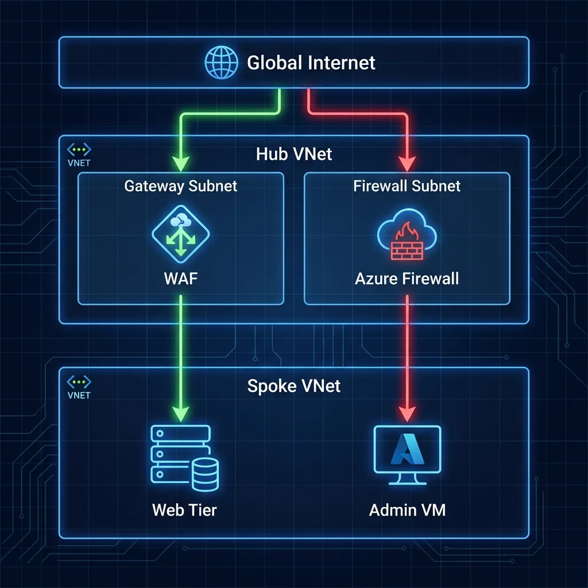
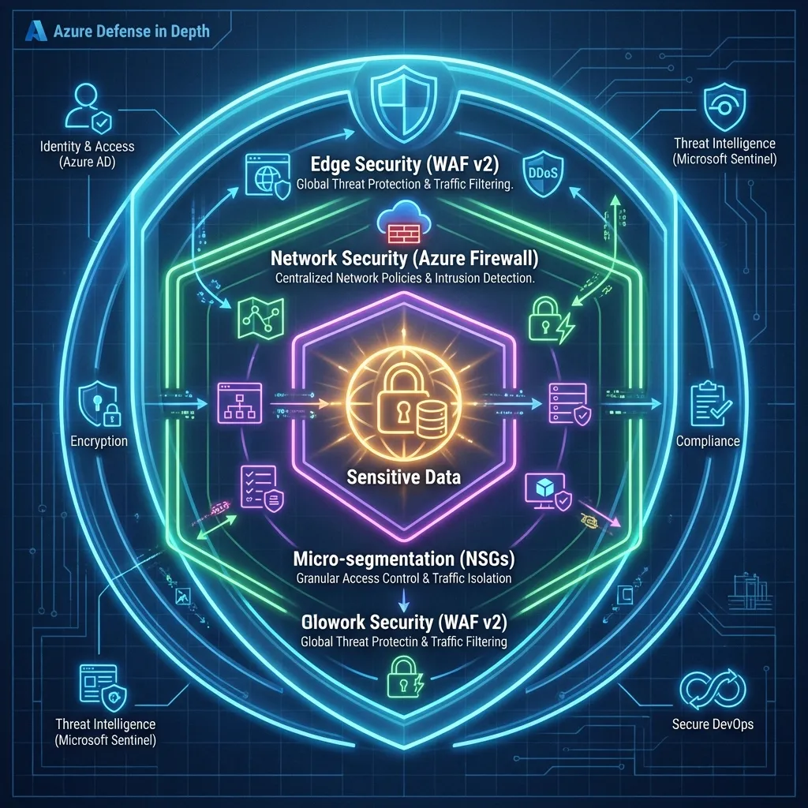

# Azure Landing Zone: Network Security & Observability


This repository contains a **Secure-by-Design** Hub-and-Spoke network implementation in Azure. Unlike "demo-grade" templates, this project implements production-hardened routing, advanced threat inspection, and elite-level observability.

## 🛡️ The Value Proposition: Why This Matters



Most cloud architectures suffer from the **"Security Shell" trap**: they deploy firewalls but fail to enforce them. This project demonstrates how to operationalize a true **Zero Trust** network by:

*   **Enforcing Inspection:** Using User Defined Routes (UDRs) to logically force 100% of spoke traffic through the Hub Firewall.
*   **Defense-in-Depth:** Combining Layer 7 WAF (App Gateway) with Layer 4-7 Firewall Premium and NSG Flow Logs.
*   **Operational Transparency:** Providing a "Single Pane of Glass" via Traffic Analytics and Connection Monitors to prove security status in real-time.

---

## 🏗️ Architecture Overview: The Vertical Anchor

The architecture follows a vertical logic designed for regulatory compliance and high-performance inspection.

### 1. The Secure Hub (The Shield)


*   **Azure Firewall Premium:** Deep Packet Inspection (DPI) and IDPS for all east-west and north-south traffic.
*   **App Gateway WAF v2:** Protecting web workloads from OWASP Top 10 vulnerabilities at the edge.
*   **Centralized Logging:** A Log Analytics Workspace acting as the brain for all telemetry.

### 2. Remediated Spokes (The Workloads)
*   **Spoke 1 (VM):** A Windows Server 2022 instance serving IIS, protected by workload-specific NSGs.
*   **Spoke 2 (PaaS):** An Azure App Service (VNET integrated) demonstrating how to secure serverless components.
*   **Remediation:** Both spokes are equipped with **Route Tables** (UDRs) that point `0.0.0.0/0` to the Firewall's private IP.

---

## 🧩 Core Components



| Component | Role | Logic |
| :--- | :--- | :--- |
| **Networking** | Hub VNet & Subnets | Pre-defined subnets for Firewall, WAF, and Gateway. |
| **Security** | Firewall & WAF Policy | Centralized policy management for consistent rule enforcement. |
| **Observability** | Traffic Analytics | Visualization of all flow logs; Identifying "Malicious IP" hits. |
| **UDRs** | Routing Enforcement | The "Secure-by-Design" link that bridges the Routing Gap. |

---

## 🚀 How to Use This Lab

### Prerequisites
*   An active Azure Subscription.
*   Terraform (v1.5+) and Azure CLI installed.
*   Permissions: Subnet Contributor or higher.

### Step 1: Clone and Initialize
```bash
git clone https://github.com/appliedailearner/AzureLandingZoneNetworkObservability.git
cd AzureLandingZoneNetworkObservability
terraform init
```

### Step 2: Deployment
Create a `terraform.tfvars` file or provide variables during the plan:
```bash
terraform plan -var "subscription_id=your-sub-id" -var "tenant_id=your-tenant-id"
terraform apply
```

### Step 3: Verification (The Proof of Work)
1.  **Check the Routes:** Navigate to the Spoke Subnet in the Azure Portal. Verify that the "Effective Routes" show `0.0.0.0/0` with a Next Hop of `Virtual Appliance` (the Firewall).
2.  **Inspect Logs:** Go to the Log Analytics Workspace -> Traffic Analytics. View the `InboundFlows` and `OutboundFlows` to confirm your firewall is seeing the traffic.

---

## 📖 The "Routing Gap" Lesson
This project was remastered to address a common architectural flaw where spokes bypass the firewall via default system routes. Read the full technical breakdown on my portfolio:
👉 [The Realist Architect: Remastering Network Observability](https://portfolio.upendrakumar.com/blog/2026-02-01-azure-landing-zone-network-observability.html)

---

## 🎁 Architecture Kit
Download the full **Architecture Kit** (Terraform Code + Diagrams + High-Res Blueprints) directly from the blog post above.

---
Created by **Upendra Kumar** | [Portfolio](https://portfolio.upendrakumar.com) | [LinkedIn](https://www.linkedin.com/in/journeytocloudwithupendra/)
