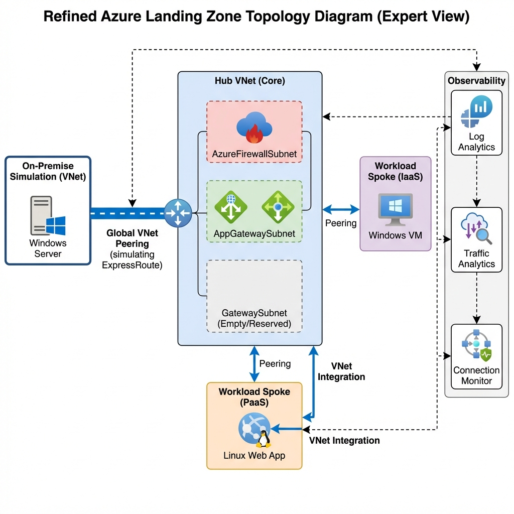
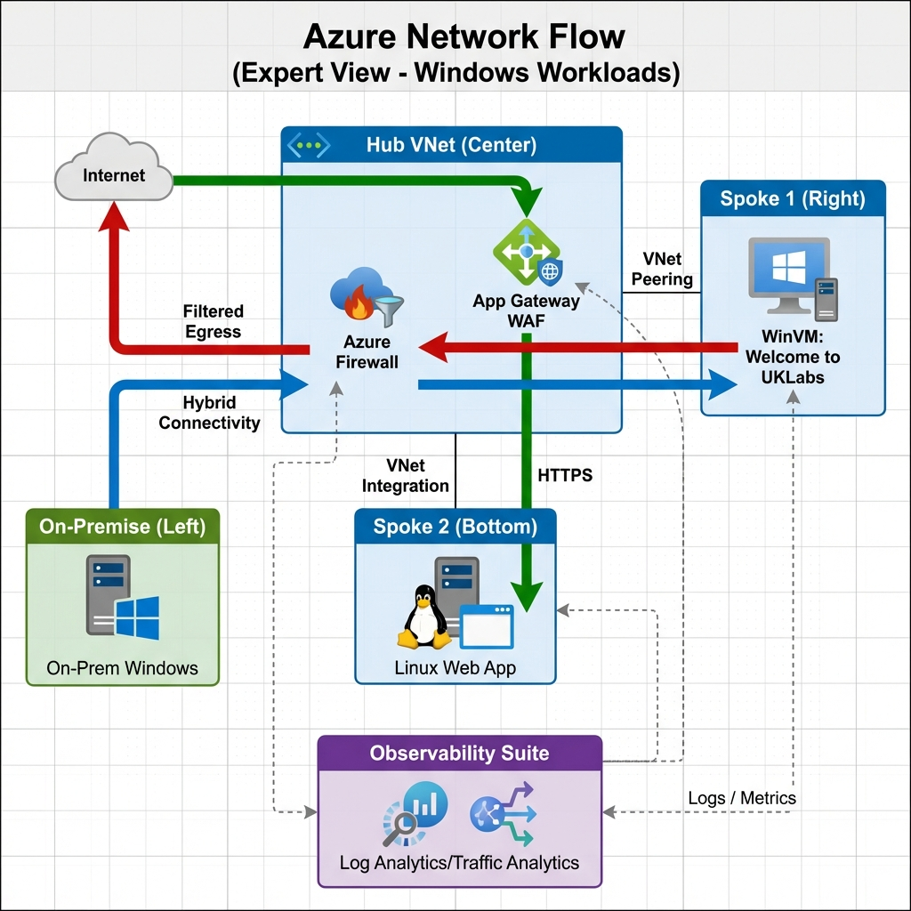
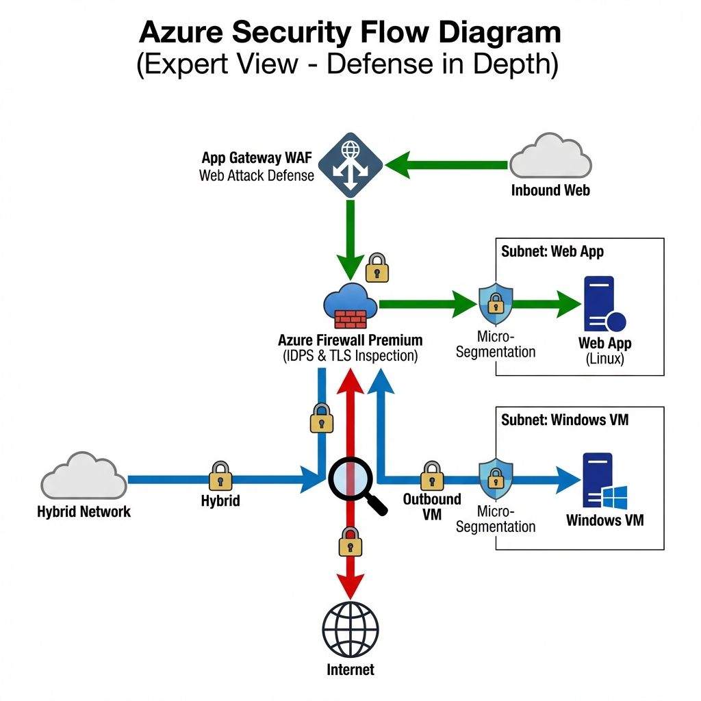
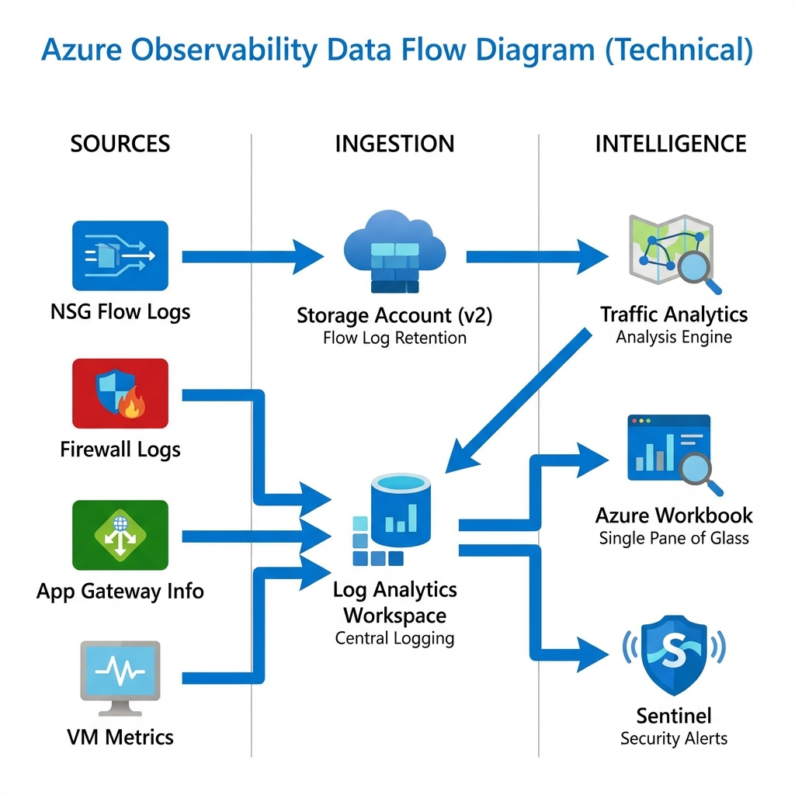

# High Level Design (HLD): Azure Landing Zone Network Observability
**"The Truth about Network Observability"**

**Version:** 3.0 (Post-Audit Final)
**Date:** February 2026
**Author:** Upendra Kumar
**Scope:** UK South (Primary) + UK Central (DR)

---

## 1. Executive Briefing
**The Situation:** Cloud reliability failures represent a failure of "Day 2" operations—specifically configuration drift, silent security failures, and opaque network paths.
**The Decision:** We have implemented a Microsoft-native landing zone that mandates inspection, standardizes inbound protection, and continuously validates network assertions.
**The Business Case:** This is risk control. One serious outage or ransomware event can exceed the annual cost of these controls.

---

## 2. Architecture Topology
The solution follows a standard **Hub-and-Spoke** network topology.

### 2.1 Core Components
*   **Hub VNet (Secure Core):** Central inspection point hosting Azure Firewall Premium and App Gateway WAF.
*   **Spoke VNets:**
    *   **Spoke 1 (IaaS):** Hosts Windows VM workloads ("UKLabs").
    *   **Spoke 2 (PaaS):** Hosts VNet-integrated Linux Web Apps.
*   **On-Premise Simulation:** A dedicated VNet peered to the Hub to mimic an ExpressRoute/VPN connection.

### 2.2 DNS Strategy
*   **Resolution:** Uses Default Azure DNS (168.63.129.16) for simplicity in this baseline.
*   **Future State:** Can be upgraded to Azure Private Resolver or Firewall DNS Proxy for hybrid name resolution.
*   **Egress Control:** The Firewall enforces FQDN filtering, ensuring workloads can only resolve and reach approved domains (e.g., `*.google.com`, `*.ubuntu.com`).

---

## 3. Key Design Decision: Parallel Edge Security
We selected the **Parallel (Zero Trust Edge)** design over serial chaining.

*   **Inbound Flow:** `Internet -> App Gateway (WAF) -> Spoke Web App`
*   **Egress Flow:** `Spoke VM -> Azure Firewall -> Internet`

**Why Parallel?**
1.  **Efficiency:** Avoids "Firewall Tax" (latency/cost) on pure web traffic.
2.  **Visibility:** Preserves Client IP for WAF geo-blocking.
3.  **Specialization:** WAF handles OWASP; Firewall handles Core IDPS/TLS.

---

## 4. Security Architecture (Defense in Depth)

### 4.1 Non-Negotiable Controls
1.  **Single Inspection Plane:** Azure Firewall Premium for all east-west and egress traffic.
2.  **Mandatory WAF:** Inbound HTTP(S) must pass through App Gateway WAF v2 in Prevention Mode.
3.  **Micro-segmentation:** NSGs on *every* subnet. Default Deny.

---

## 5. Cost Model (FinOps Strategy)

| Component | SKU Selected | Why? | Optimization Strategy |
| :--- | :--- | :--- | :--- |
| **Azure Firewall** | **Premium** | Required for TLS Inspection & IDPS. Standard is blind to encrypted threats. | Use **Policy Rules** to block noisy traffic early. |
| **App Gateway** | **WAF v2** | Required for Auto-scaling and Zone Redundancy. | Enable **Auto-Scale** (min 0 or 1 instances in dev) to save costs during off-hours. |
| **Log Analytics** | **Per GB / Commitment** | Required for retention and querying. | Set **Retention** to 30 days for hi-volume logs; Archive to Storage Account for long-term compliance. |
| **Flow Logs** | **Version 2** | V2 is faster and supports throughput stats. | Enable only on **Critical Subnets** (Gateway, Firewall, Prod Workload) to control ingestion costs. |

---

## 6. Observability Strategy (The "Trinity")

We implement three pillars to "prove the negative" and validate network health.

| Tool | Role | What it does | What it does NOT do |
| :--- | :--- | :--- | :--- |
| **NSG Flow Logs** | The Camera | Records every packet (allow/deny) | Real-time alerting |
| **Traffic Analytics** | The Brain | Visualizes flows, detecting malicious IPs and drift | IDS/IPS prevention (That's Firewall) |
| **Connection Monitor** | The Pulse | Tests critical paths (VM -> Internet) 24/7 | Application correctness checks |

### 6.1 Technical Implementation
The observability stack is built on the **Azure Network Watcher** extension.

1.  **NSG Flow Logs (Data Plane):**
    *   **Source:** Enabled on *every* NSG (Hub & Spokes).
    *   **Storage:** Logs are sent to a **Storage Account (v2)**.
    *   **Retention:** Configured for 30 days to balance compliance vs. cost.

2.  **Traffic Analytics (Visualization Plane):**
    *   **Ingestion:** Scrapes the Storage Account logs every 10 minutes.
    *   **Output:** Generates the "Map" view in Log Analytics, flagging "Malicious Flows" and "subnet-to-subnet" dependency maps.

3.  **Connection Monitor (Synthetic Traffic):**
    *   **Agent:** The `NetworkWatcherAgent` extension is installed on the Spoke VM ("UKLabs").
    *   **Tests:**
        *   *Test Group 1:* **Egress Check.** Pings `8.8.8.8` (Google DNS) on port 53. Success = Firewall Rules are working.
        *   *Test Group 2:* **Hybrid Check.** Pings `On-Prem VM` internal IP. Success = VNet Peering is working.

---

## 7. RACI Matrix

| Area | Platform Team | Security Team | App Team |
| :--- | :--- | :--- | :--- |
| **Firewall + Routing** | Accountable / Responsible | Consulted | Consulted |
| **WAF Policy** | Responsible | Accountable / Consulted | Consulted |
| **Flow Logs** | Accountable / Responsible | Consulted | Consulted |
| **Drift Reviews** | Responsible | Accountable / Consulted | Consulted |
| **Spoke NSGs** | Consulted | Consulted | Accountable / Responsible |

---

## 8. Truthful Limitations
*   **Monitoring ≠ Prevention:** Observability tells you *what happened*, it doesn't stop it (Firewall/NSGs do that).
*   **TLS Overhead:** Inspection adds latency; factor this into SLA calculations.
*   **Discipline:** Without strict Terraform pipeline enforcement, manual changes *will* cause drift.

---

## 9. Enterprise Hardening (Next Steps)
To elevate this solution from a "Technical Baseline" to a "Production Standard," we recommend the following four upgrades:

### 9.1 Single Pane of Glass (Azure Workbook)
*   **Current State:** Disparate logs (Flows in Storage, Firewall in Log Analytics).
*   **Upgrade:** specific **Azure Monitor Workbook** (`dashboard.json`).
*   **Value:** A single dashboard correlating "Red" traffic flows with Firewall Deny events for executive visibility.

### 9.2 Policy-Driven Governance
*   **Current State:** Manual trust that Spoke VNet settings remain correct.
*   **Upgrade:** Assign **Azure Policy** definitions (e.g., `Deny-PublicIP-On-Spokes`).
*   **Value:** Proves governance maturity by enforcing security standards in code.

### 9.3 CI/CD Pipeline (GitHub Actions)
*   **Current State:** Terraform runs locally ("ClickOps").
*   **Upgrade:** Implement `.github/workflows/deploy.yaml` using **OIDC Federation**.
*   **Value:** Audit trail of *who* deployed *what* and *when*, eliminating "it works on my machine" issues.

### 9.4 Identity Hardening
*   **Current State:** VM uses local admin credentials or connection strings.
*   **Upgrade:** Enable **System Assigned Managed Identity** for the Spoke VMs.
*   **Value:** Zero-credential access to Azure Storage and Key Vault.

---

## 10. Final Recommendation
Approve this baseline. It balances **Security** (Zero Trust), **Cost** (Right-sized observability), and **Operability** (Evidence-based troubleshooting).
